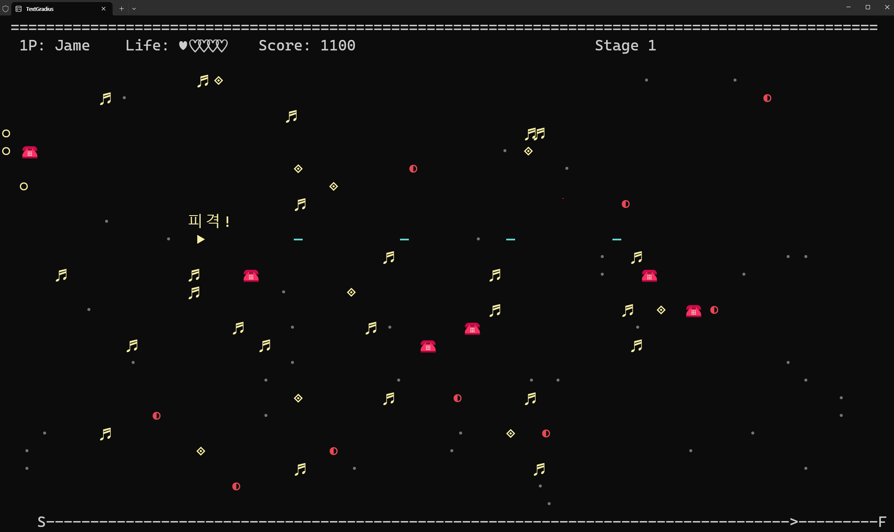
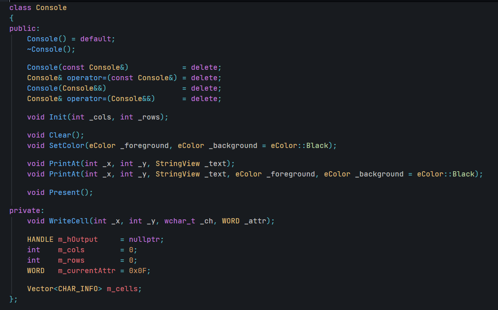
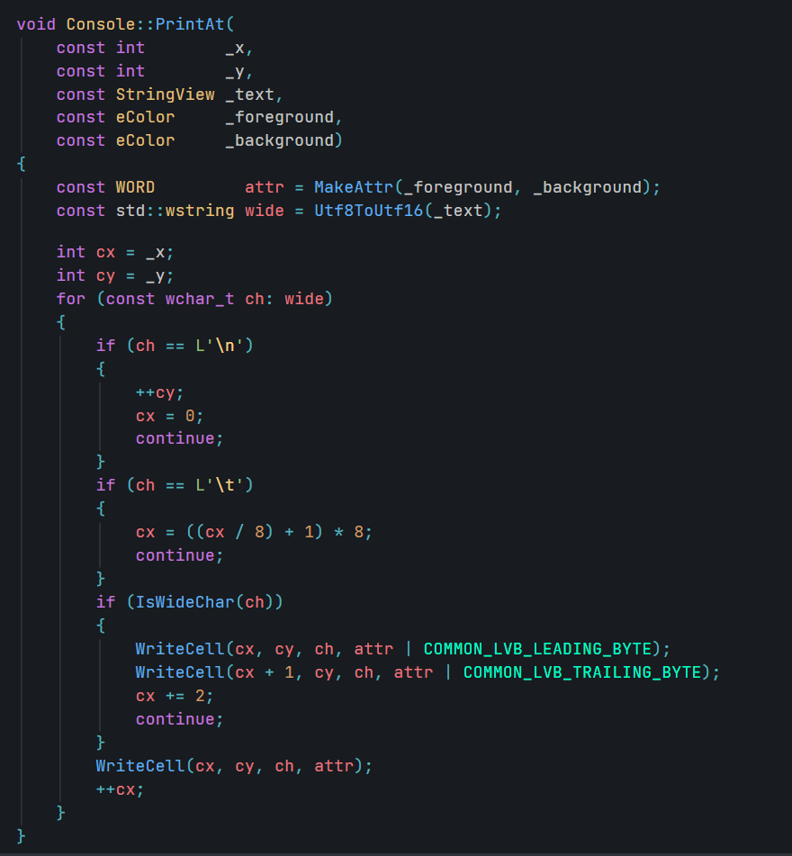
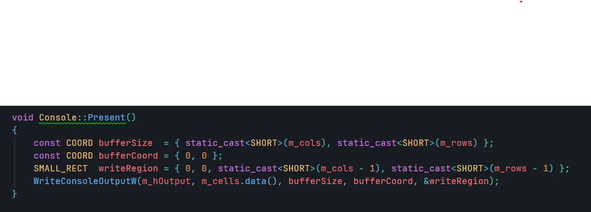
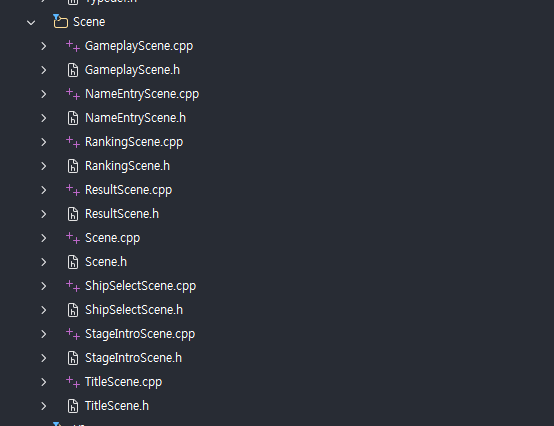
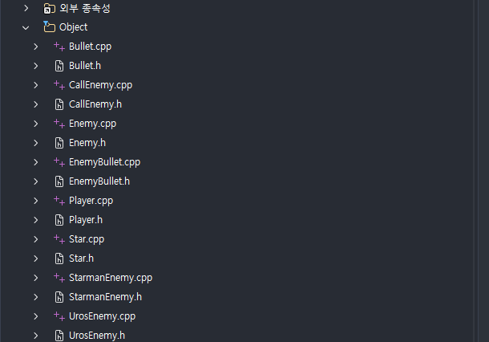
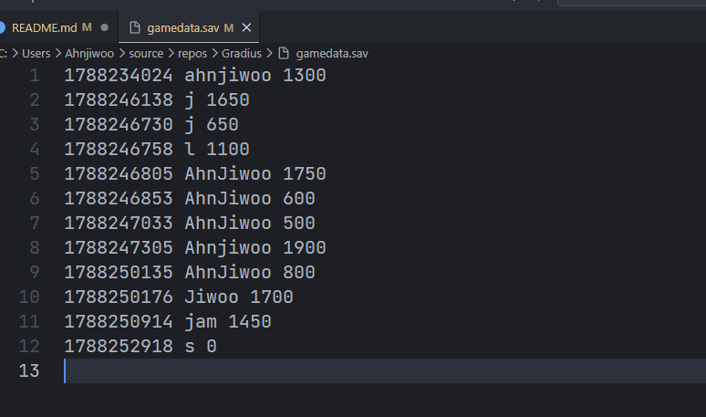

# TextGradius

[]()
[]()

콘솔 창에서 실행되는 텍스트 기반 슈팅 게임입니다. 고전 슈팅 게임 Gradius에서 영감을 받아, 우주선을 조종해 적을 물리치고 점수를 획득하는 게임을 만들었습니다. C++20으로 작성했고 Windows(MSVC) 환경에서 동작하며, 제가 처음으로 완성한 프로젝트입니다.



<video src="Resources/DemoPlay.mp4" controls width="720"></video>

<br>

## 목차

- [소개](#소개)
- [핵심 포인트](#핵심-포인트)
  - [1. 콘솔 환경 실시간 렌더링](#1-콘솔-환경-실시간-렌더링)
  - [2. Scene 기반 구조 설계](#2-scene-기반-구조-설계)
  - [3. GameObject 기반 구조 설계](#3-gameobject-기반-구조-설계)
  - [4. 파일 입출력 기반 랭킹 시스템](#4-파일-입출력-기반-랭킹-시스템)
- [개발 환경](#개발-환경)
- [실행 방법](#실행-방법)
- [회고](#회고)

<br>

## 소개

C/C++ 기본기를 다지고 콘솔 환경에서 게임을 직접 구현해보기 위해 시작한 프로젝트입니다. 게임 루프, 화면 출력, 키보드 입력 처리, 충돌 판정, 점수 계산 등 게임 개발의 기본 요소를 하나씩 구현하며 개념을 익혔습니다.

클래스, 구조체, 포인터, 동적 메모리 할당 등 C++의 기본 문법을 실습하고 OOP를 실제 설계에 적용하면서, 가독성과 유지보수성을 고려한 구조를 고민할 수 있었습니다. STL도 적극 활용해 코드 효율을 높이려 노력했습니다.

마지막으로 파일 입출력을 구현해 게임 데이터를 저장·불러오는 기능을 추가하면서, 간단한 직렬화·역직렬화 개념도 익힐 수 있었습니다.

<br>

## 핵심 포인트

### 1. 콘솔 환경 실시간 렌더링

`std::cout`, `printf` 같은 기본 콘솔 출력은 실시간 렌더링에 적합하지 않습니다. 호출할 때마다 화면이 즉시 갱신되기 때문에, 사용자 입장에서는 렌더링되는 과정 자체가 그대로 보이게 됩니다 (이른바 Blink). 콘솔 출력 함수는 동기화를 위한 락, 시스템 콜을 위한 커널 모드 전환 등으로 인해 성능도 좋지 않습니다. 초기에는 Blink는 물론 렌더링 속도 자체가 너무 느려서 게임 플레이가 불가능한 수준이었습니다.

이를 해결하기 위해 콘솔 버퍼와 동일한 크기의 2차원 배열을 만들어, 콘솔에 직접 그리는 대신 이 배열에만 그리고 프레임당 한 번만 콘솔에 출력하는 방식을 사용했습니다. 픽셀 하나를 찍는 비용이 배열에 값을 써넣는 비용으로 줄고, 콘솔 출력 비용은 프레임당 1회로 크게 줄어들면서 Blink 문제와 렌더링 속도 문제를 함께 해결할 수 있었습니다.

여기서 한 단계 더 나아가, `system()` 콜로 출력하는 대신 콘솔 핸들을 직접 가져와 `WriteConsoleOutputW`로 출력하도록 구현했습니다. 오프스크린 렌더링을 흉내 내는 방식으로, 결과적으로 콘솔 환경에서의 더블 버퍼링을 구현한 셈이 되었습니다. 렌더링이 눈에 띄게 부드러워졌고, 게임 플레이에 충분한 수준으로 성능이 향상되었습니다.







### 2. Scene 기반 구조 설계

게임은 여러 개의 Scene으로 구성되어 있으며, 각 Scene은 게임의 특정 상태를 나타냅니다. Title Scene, Game Scene, Game Over Scene 등이 있으며, 각 Scene은 독립적으로 동작하고 필요한 경우 다른 Scene으로 전환됩니다. 이를 위해 `Scene`이라는 추상 클래스를 정의하고, 각 화면은 이 클래스를 상속받아 구현했습니다.

이 설계의 특징은 Scene의 로직을 독립적으로 관리할 수 있다는 점입니다. 각 Scene은 자신의 상태를 유지하며 다른 Scene과의 의존성을 최소화합니다. 씬을 전환할 때도 포인터만 바꿔주면 되므로 전환 로직이 단순하며, 새로운 씬을 추가할 때도 기존 코드를 수정할 필요 없이 클래스만 추가하면 되어 확장성이 좋습니다.



### 3. GameObject 기반 구조 설계

Scene이 화면 단위의 상태를 나타낸다면, GameObject는 그 화면 안에서 실제로 움직이는 개체들을 나타냅니다. 게임은 다양한 GameObject로 구성되어 있으며, 각 GameObject는 게임 내에서 특정 역할을 수행합니다. 플레이어 캐릭터, 적 캐릭터, 총알, 아이템 등이 있으며, 각 GameObject는 독립적으로 동작하고 필요한 경우 다른 GameObject와 상호작용합니다. 이를 위해 `GameObject`라는 추상 클래스를 정의하고, 각 오브젝트는 이 클래스를 상속받아 구현했습니다.

Scene과 마찬가지로 각 GameObject가 자신의 상태를 독립적으로 관리해 다른 오브젝트와의 의존성을 최소화하며, 새로운 오브젝트를 추가할 때도 기존 코드를 수정할 필요 없이 클래스만 추가하면 되는 구조입니다.



### 4. 파일 입출력 기반 랭킹 시스템

간단한 파일 포맷을 정의해, 게임 종료 시 플레이어의 점수를 파일에 저장하고 게임 시작 시 파일에서 불러오는 랭킹 시스템을 구현했습니다. 이를 통해 플레이어는 자신의 점수를 기록하고 다른 플레이어와 비교할 수 있어, 게임에 경쟁 요소를 더할 수 있었습니다.



<video src="Resources/RankingDemo.mp4" controls width="720"></video>

<br>

## 개발 환경

| 항목 | 내용 |
|---|---|
| 언어 | C++20 |
| 플랫폼 | Windows |
| 컴파일러 | MSVC (Visual Studio, v145 툴셋) |
| 렌더링 | Win32 Console API (`WriteConsoleOutputW`) |

<br>

## 실행 방법

```bash
# Visual Studio 로 TextGradius.slnx 를 열고 빌드
# 또는 MSBuild 로 직접 빌드:
msbuild TextGradius.vcxproj /p:Configuration=Release /p:Platform=x64
```

방향키로 이동하며, 사격은 자동으로 이루어집니다. Enter 키로 메뉴를 선택하거나 스테이지를 스킵할 수 있습니다.

<br>

## 회고

이 프로젝트를 통해 디버깅 능력과 성능 병목을 찾아내는 능력을 가장 크게 키울 수 있었습니다. 문제를 조용히 감추는 설계보다는, 프로그램 곳곳에 ASSERT를 심어두고 문제가 발생하면 즉시 크래시를 일으켜 그 자리에서 디버깅으로 원인을 해결하는 방식으로 개발을 진행했습니다.

성능 병목을 찾아내기 위해서는 게임 루프의 각 단계별로 소요되는 시간을 측정하고, 병목이 발생하는 부분을 찾아 최적화하는 과정을 반복했습니다. 눈에 보이지 않는 곳에서도 병목이 발생할 수 있다는 사실을 알게 되었고, 이를 해결하기 위해 여러 방법을 시도하며 성능을 끌어올렸습니다. 특히 Windows API를 활용해 콘솔 출력을 개선하고, 오프스크린 렌더링으로 더블 버퍼링을 구현한 것은 스스로도 만족스러운 결과물이었습니다.

우여곡절이 많았지만, 꽤 만족스러운 프로젝트를 완성할 수 있었습니다.
