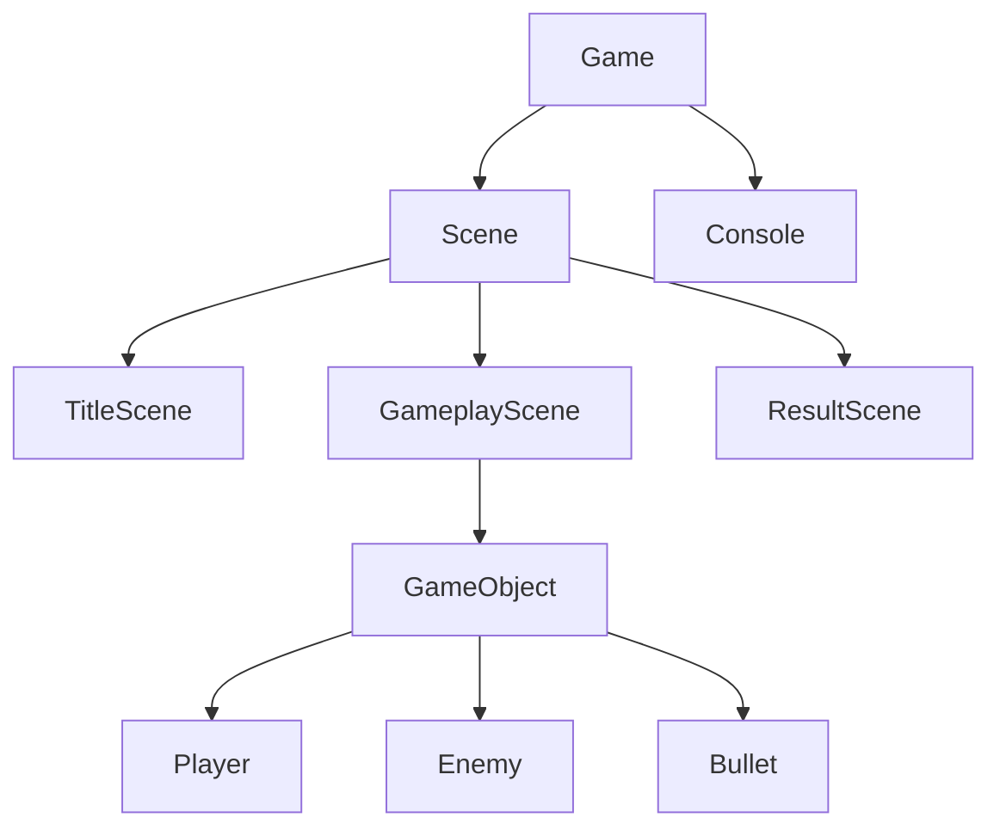

<!--
  발표자료용 README 템플릿.
  [ ] 로 감싼 부분은 직접 채우고, <!-- --> 주석은 다 지우고 쓰면 됨.
  섹션 순서 자체가 "발표 흐름"이라 위에서부터 슬라이드 넘기듯 읽히게 짬:
  후킹 → 데모 → 배경/동기 → Before/After → 아키텍처 → 실행법 → 회고.
-->

# TextGradius

> [한 줄 태그라인 — 예: "초등학생 때 만든 콘솔 슈팅게임, 지금 다시 만들면 어떨까?"]

[]()
[]()
[]()

<!-- 뱃지는 장식용. 굳이 CI 안 돌리면 build 뱃지는 빼도 됨. -->

<br>

<!-- ============================================================ -->
<!-- 1. 데모 — 발표자료면 이게 사실상 제일 중요함. 글 읽기 전에 3초짜리 -->
<!--    움짤부터 보여줘야 시선 잡힘. 영상 찍으면 유튜브 링크+썸네일. -->
<!-- ============================================================ -->

## 데모

<!--
  옵션 A) GIF (짧고 임팩트 있는 거 하나 — 타이틀→인게임 전환, 또는 보스/연출 장면)
  

  옵션 B) 유튜브 영상 (썸네일 클릭 → 재생)
  [](https://youtu.be/VIDEO_ID)
-->

[여기에 GIF 또는 영상 링크]

<br>

## 목차

- [소개](#소개)
- [Before / After](#before--after)
- [핵심 포인트](#핵심-포인트)
- [아키텍처](#아키텍처)
- [실행 방법](#실행-방법)
- [조작법](#조작법)
- [프로젝트 구조](#프로젝트-구조)
- [회고](#회고)

<br>

<!-- ============================================================ -->
<!-- 2. 소개 — "이게 뭐고 왜 만들었나"를 3문장 안에. 발표라면 여기서 -->
<!--    스토리(배경/계기)가 제일 듣는 사람 흥미 끄는 부분. -->
<!-- ============================================================ -->

## 소개

[언제, 왜 처음 만들었는지 — 예: "OO살 때 C로 처음 만든 콘솔 슈팅게임. 그때는 몰랐던 문제들(전역변수, goto, 매 프레임 cls)이 잔뜩 있었음."]

[이번에 왜 다시 손댔는지 — 예: "지금 실력으로 같은 걸 다시 짜면 얼마나 달라지는지 보고 싶어서 처음부터 재설계함."]

<br>

<!-- ============================================================ -->
<!-- 3. Before/After — 발표자료 하이라이트. 숫자/표로 임팩트 주기 좋음. -->
<!--    옛날 스크린샷 vs 지금 스크린샷 나란히 놓으면 제일 좋음. -->
<!-- ============================================================ -->

## Before / After

| | 예전 | 지금 |
|---|---|---|
| 구조 | `main.cpp` 한 파일, 1400줄 | `Source/` [N]개 파일, 역할별 분리 |
| 렌더링 | 매 프레임 `system("cls")` + `printf` | 메모리 그리드 → 더블버퍼 스왑 (`Console`) |
| 상태 관리 | 전역변수 + `goto` | `Scene` 상속 구조 |
| 오브젝트 | 구조체 낱개 (`_Player`, `_enemy`...) | `GameObject` 상속 트리 |
| 출력 | `printf`/`puts` 여기저기 | `Console` 한 곳으로 통일 |

<!-- 스크린샷 나란히 비교 넣고 싶으면:
<table><tr>
<td></td>
<td></td>
</tr></table>
-->

<br>

<!-- ============================================================ -->
<!-- 4. 핵심 포인트 — 발표에서 "이번에 이런 거 신경 썼다" 3~4개 카드. -->
<!--    각각 한 줄 설명 + (있으면) 코드 스니펫 하나씩. -->
<!-- ============================================================ -->

## 핵심 포인트

### [포인트 1 — 예: 진짜 더블버퍼링]
[한두 줄 설명. 왜 필요했고 어떻게 풀었는지.]

### [포인트 2 — 예: Scene 기반 상태 전환]
[설명]

### [포인트 3 — 예: GameObject 상속 구조]
[설명]

<br>

<!-- ============================================================ -->
<!-- 5. 아키텍처 — 여기가 발표에서 다이어그램 한 장 띄우기 좋은 자리. -->
<!--    mermaid로 그리거나, 손그림 캡처해서 이미지로 넣어도 됨. -->
<!-- ============================================================ -->

## 아키텍처



[다이어그램 밑에 한 문단 정도로 데이터 흐름 설명]

<br>

<!-- ============================================================ -->
<!-- 6. 실행 방법 — 발표 라이브 데모 직전에 참고할 사람 위한 실용 섹션. -->
<!-- ============================================================ -->

## 실행 방법

```bash
# Visual Studio 2022+ (v145 툴셋) 로 TextGradius.slnx 열고 빌드
# 또는 MSBuild 직접:
msbuild TextGradius.vcxproj /p:Configuration=Release /p:Platform=x64
```

요구사항: Windows, C++20, Win32 콘솔 API

<br>

## 조작법

| 키 | 동작 |
|---|---|
| 방향키 | 이동 |
| (자동) | 사격 |
| Enter | 메뉴 선택 / 스테이지 스킵 |

<br>

<!-- ============================================================ -->
<!-- 7. 프로젝트 구조 — 훑어보기용. 너무 길면 접어두기(<details>). -->
<!-- ============================================================ -->

## 프로젝트 구조

<details>
<summary>펼쳐보기</summary>

```
Source/
├── Game.h/.cpp          # 진입점, 메인 루프, 씬 전환
├── Scene.h              # 씬 베이스, Update() 상속
├── *Scene.h/.cpp        # Title/NameEntry/ShipSelect/Gameplay/Result/Ranking
├── GameObject.h/.cpp    # 모든 오브젝트 베이스
├── Player/Enemy/Bullet  # GameObject 파생
├── Console.h/.cpp       # 더블버퍼 렌더러
└── Embed.h/.cpp         # UI/타이틀 텍스트
```

</details>

<br>

<!-- ============================================================ -->
<!-- 8. 회고 — 발표 마무리용. 뭘 배웠는지, 뭐가 어려웠는지, -->
<!--    다음에 시간 있으면 뭘 더 하고 싶은지. -->
<!-- ============================================================ -->

## 회고

[뭐가 제일 어려웠는지 / 예상 못했던 문제 — 예: "WriteConsoleOutput 이 한글 폭을 몰라서 정렬 다 깨졌던 거"]

[다음에 시간 나면 할 것 — 예: "스테이지 더 늘리기, 사운드"]

<br>

---

<sub>[이름/링크] · [연도]</sub>
