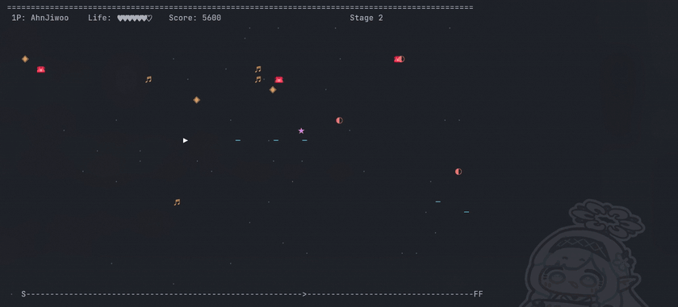
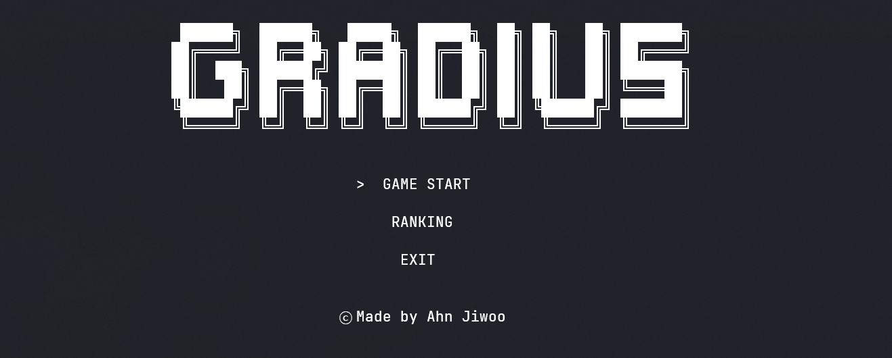
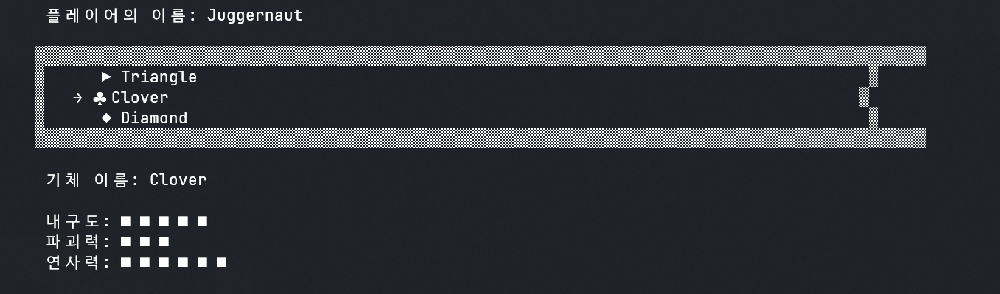
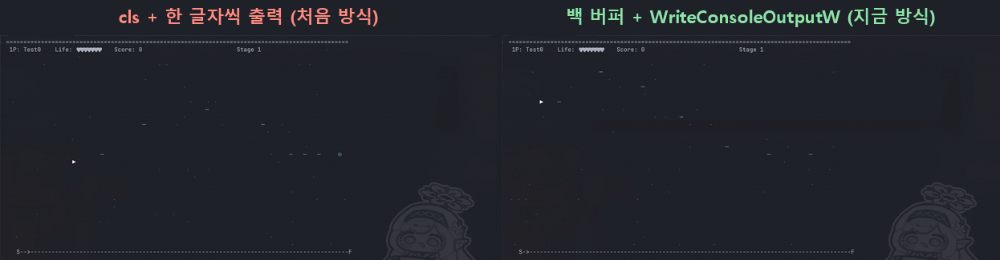
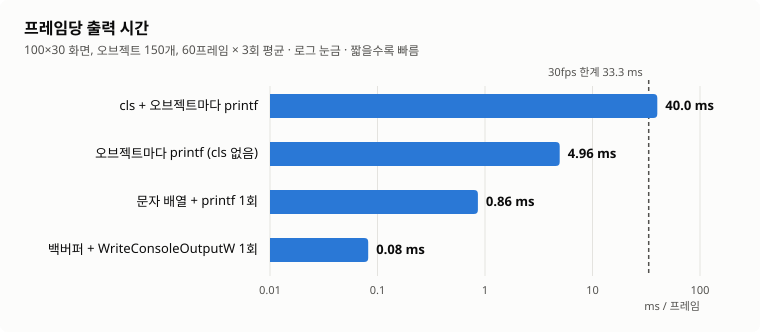
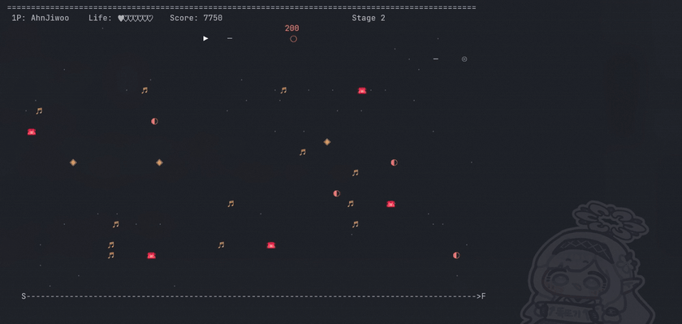

<div align="center">

```
 ██████╗  ██████╗   █████╗  ██████╗  ██╗ ██╗   ██╗ ███████╗
██╔════╝  ██╔══██╗ ██╔══██╗ ██╔══██╗ ██║ ██║   ██║ ██╔════╝
██║  ███╗ ██████╔╝ ███████║ ██║  ██║ ██║ ██║   ██║ ███████╗
██║   ██║ ██╔══██╗ ██╔══██║ ██║  ██║ ██║ ██║   ██║ ╚════██║
╚██████╔╝ ██║  ██║ ██║  ██║ ██████╔╝ ██║ ╚██████╔╝ ███████║
 ╚═════╝  ╚═╝  ╚═╝ ╚═╝  ╚═╝ ╚═════╝  ╚═╝  ╚═════╝  ╚══════╝
```

# Text Gradius

**Windows 콘솔 창 안에서 돌아가는 C++ 횡스크롤 슈팅 게임**


[프로젝트 소개](#프로젝트-소개) · [게임 소개](#게임-소개) · [코드 둘러보기](#코드-둘러보기) · [C++로 구조 잡기](#1-c로-구조-잡기) · [다형성](#2-다형성으로-씬과-적-다루기) · [더블 버퍼링](#3-콘솔에서-더블-버퍼링-구현하기) · [랭킹 파일](#4-파일로-랭킹-저장하기) · [빌드 및 실행](#빌드-및-실행) · [회고](#회고)

</div>

<p align="center"></p>

<br>

## 프로젝트 소개

TextGradius는 고전 슈팅 게임 *Gradius*에서 영감을 받아 만든 횡스크롤 슈팅 게임입니다. Windows 콘솔 창을 픽셀처럼 써서 화면을 그립니다. 우주선을 조종해 몰려오는 적을 격추하고, 스테이지 두 개를 버티면 점수가 랭킹 파일에 기록됩니다.

처음 만든 출력 방식은 화면 한 장을 그리는 데 약 40ms가 걸렸습니다. 초당 30프레임도 안 나왔습니다. 백 버퍼에 먼저 그리고 `WriteConsoleOutputW`로 한 번에 내보내도록 바꾸면서 0.082ms까지 줄였습니다([더블 버퍼링](#3-콘솔에서-더블-버퍼링-구현하기)). 그리고 적 종류마다 따로 돌던 처리 코드를 `Enemy*` 목록 하나로 합쳤더니, 매 프레임 적과 적 탄을 다루는 반복문이 19개에서 8개로 줄었습니다([다형성](#2-다형성으로-씬과-적-다루기)).

C/C++ 기본기를 다지고, 콘솔에서 게임을 직접 구현해 보려고 시작했습니다. 제가 처음으로 끝까지 완성한 프로젝트입니다. 클래스, 구조체, 포인터, 동적 메모리 같은 기본 문법을 실제 설계에 적용해 보는 것이 목표였습니다.

<br>

## 게임 소개

### 한 판의 흐름

타이틀에서 `GAME START`를 고르면 이름을 입력하고, 세 기체 중 하나를 고릅니다. 스테이지마다 미션 안내 화면이 먼저 나오고, Enter를 누르면 바로 시작합니다. 화면 아래 진행 막대가 끝까지 차면 스테이지 클리어입니다. 스테이지 2가 시작될 때 목숨과 위치는 처음으로 돌아가지만 점수는 이어집니다. 두 스테이지를 버티거나 도중에 목숨을 모두 잃으면 결과 화면으로 넘어가고, 여기서 Enter를 누르면 기록이 저장된 뒤 타이틀로 돌아갑니다. 타이틀의 `RANKING`에서는 상위 10개 기록을 볼 수 있습니다.

<p align="center">
  
  
</p>

### 조작과 기체

방향키로 움직이고, 사격은 자동입니다. 기체는 좌우로 2칸, 위아래로 1칸씩 움직입니다. 콘솔 글자 칸은 보통 세로가 가로의 두 배쯤 길어서, 이렇게 해야 화면에서 비슷한 거리로 보입니다.

게임은 초당 30프레임으로 돌아가고, 모든 적의 체력은 14입니다. 기체마다 목숨, 데미지, 발사 간격이 달라서 적 하나를 격추하는 데 필요한 탄 수도 달라집니다.

| 기체 | 목숨 | 한 발 데미지 | 발사 간격 | 적 하나를 격추하는 탄 수 |
|---|:---:|:---:|:---:|:---:|
| Triangle ▶ | 7 | 5 | 4프레임 | 3발 |
| Clover ♣ | 5 | 3 | 2프레임 | 5발 |
| Diamond ◆ | 6 | 7 | 6프레임 | 2발 |

Clover는 한 발이 약하지만 가장 자주 쏘는 대신 목숨이 가장 적습니다.

### 적

| 적 | 점수 | 움직임 | 공격 |
|---|:---:|---|---|
| Uros ◐ | 100 | 위아래로 흔들리며 천천히 전진 | 1초마다 정면으로 한 발 |
| Call ☎ | 150 | 곧게 전진 | 1.5초마다 세 갈래로 퍼지는 탄 |
| Starman ★ | 200 | 스테이지 2에만 등장. 플레이어를 쫓아오다 약 1.3초 뒤 사라짐 | 몸으로 부딪힘 |

Uros와 Call은 왼쪽 끝을 지나면 오른쪽 끝에서 다시 나타나기 때문에, 격추하지 않은 적은 스테이지 내내 남습니다. 적이나 적 탄에 맞으면 목숨이 하나 줄고, 1초 동안 무적이 되며 기체 위에 `피격!`이 뜹니다.

<br>

## 코드 둘러보기

### 파일 구성

실제 폴더는 `Source/` 하나지만, Visual Studio 솔루션 탐색기에서는 역할별 필터로 묶어 두었습니다.

```
TextGradius
├── TextGradius.slnx     게임 프로젝트 + 벤치마크 프로젝트
├── Source
│   ├── Core     main, Game, Console, GameObject, Config, Input, Random, Typedef
│   ├── Scene    Scene, TitleScene, NameEntryScene, ShipSelectScene,
│   │            StageIntroScene, GameplayScene, ResultScene, RankingScene
│   ├── Object   Player, Bullet, Star, Enemy, UrosEnemy, CallEnemy,
│   │            StarmanEnemy, EnemyBullet
│   └── UI       Embed, RankingData
├── Benchmark    출력 방식별 속도 측정 프로그램과 차트 생성 스크립트
└── Resources    README 이미지와 벤치마크 차트
```

UI 묶음의 [`Embed`](Source/Embed.cpp)는 타이틀 로고, 메뉴, 결과 화면, 랭킹 표, HUD처럼 화면에 찍을 문자열을 조립하는 `Build...()` 함수만 모아 둔 파일입니다. 씬 코드는 이 함수가 돌려준 문자열을 `PrintAt()`으로 찍기만 합니다. 화면 문자열을 씬 안에 그대로 두면 입력을 처리하는 몇 줄이 문자열 사이에 묻혀서 따로 뺐습니다.

<details>
<summary>Core·Object 파일별 역할</summary>

| 파일 | 역할 |
|---|---|
| [`Game`](Source/Game.h) | 콘솔, 현재 씬, 플레이어, 이번 판의 이름·점수·ID·스테이지를 가지고 게임 루프와 씬 교체를 맡음 |
| [`Console`](Source/Console.h) | 100×30 백 버퍼에 글자를 쓰고 프레임마다 한 번 콘솔로 출력 |
| [`GameObject`](Source/GameObject.h) | 위치, 모양 문자열, 색, 생존 여부, 기본 그리기를 가진 오브젝트 부모 클래스 |
| [`Config.h`](Source/Config.h) | 화면 크기, 프레임 속도, 풀 크기, 적 체력, 키 코드, `GRAD_ASSERT` 매크로 |
| [`Input.h`](Source/Input.h) | 방향키와 일반 문자를 구분해 읽는 `ReadKey()` |
| [`Player`](Source/Player.cpp) | 기체 수치, 이동, 자동 사격, 목숨과 무적 시간. 자기 탄 20개를 소유 |
| [`Bullet`](Source/Bullet.cpp) | 플레이어 탄. 한 프레임에 3칸 전진, 맞으면 잠깐 터지는 모양을 보여 주고 사라짐 |
| [`Enemy`](Source/Enemy.h) | 체력, 피격 판정, 격추 연출, 점수 전달 등 세 적의 공통 부분 |
| [`UrosEnemy`](Source/UrosEnemy.cpp) · [`CallEnemy`](Source/CallEnemy.cpp) · [`StarmanEnemy`](Source/StarmanEnemy.cpp) | 각자의 움직임과 공격 |
| [`EnemyBullet`](Source/EnemyBullet.cpp) | 적 탄. 대각선 탄이 한 프레임에 0.25칸씩 움직일 수 있게 위치를 `float`으로 가짐 |

</details>

### 프레임 하나가 처리되는 순서

게임 전체는 [`Game::Run()`](Source/Game.cpp)의 반복문 하나로 돌아갑니다.

```cpp
while (true)
{
    Sleep(kFrameDelayMs);                       // 1000 / 30 = 33ms

    const eSceneId next = m_scene->Update();    // 현재 씬의 로직 + 백 버퍼에 그리기
    m_console.Present();                        // 백 버퍼를 콘솔로 한 번에 출력

    if (next == eSceneId::Exit)
    {
        break;
    }
    if (next != eSceneId::None)
    {
        m_scene = CreateScene(next);            // 이전 씬은 여기서 소멸
        m_scene->OnEnter();
    }
}
```

씬은 `Update()` 안에서 콘솔에 직접 출력하지 않고 백 버퍼에 그리기만 합니다. 콘솔에 실제로 출력하는 곳은 루프 안의 `Present()` 한 군데뿐입니다. 어떤 씬이 떠 있든 출력은 프레임마다 한 번입니다.

게임 플레이 중의 `Update()`인 [`GameplayScene::Update()`](Source/GameplayScene.cpp)는 다섯 단계로 나뉩니다.

```cpp
++m_ct;                  // 스테이지 시작 후 지난 프레임 수
SpawnWave();             // m_ct를 보고 나올 차례인 적을 풀에서 살림
UpdateActors();          // 플레이어 → 별 → 적 이동(+피격 판정) → 적 발사 → 적 탄 이동
ResolveContactDamage();  // 적 몸체·적 탄이 플레이어에 닿았는지
CollectScores();         // 격추 연출이 끝난 적의 점수를 더함
Render();                // 별 → 플레이어 → 적 → 적 탄 → HUD → 진행 막대
```

그 뒤 플레이어의 목숨이 0 이하면 결과 씬을, `m_ct`가 940에 도달했으면 다음 스테이지 소개나 결과 씬을 돌려줍니다. 적 등장, 플레이어 발사, 진행 막대, 스테이지 종료는 전부 `m_ct` 하나로 정해집니다.

적은 자기 몸을 움직인 다음, 이번 프레임에 이미 움직인 플레이어 탄과 겹치는지 확인합니다. `Render()`는 맨 마지막에 부릅니다. 판정이 다 끝난 상태를 그려야 하니까요. 그리는 순서도 중요합니다. 같은 칸에 두 번 쓰면 나중에 쓴 글자가 남기 때문에, HUD와 진행 막대를 마지막에 그려서 무엇이 지나가도 가려지지 않게 했습니다.

<details>
<summary>입력을 읽는 두 가지 방법</summary>

게임 중 이동은 `GetAsyncKeyState`로, 메뉴는 `_kbhit()`/`_getch()`로 읽습니다. `GetAsyncKeyState`는 "지금 이 키가 눌려 있는가"를 알려 주므로 누르고 있는 동안 계속 움직이고 두 방향키를 같이 누르면 대각선으로 갑니다. 메뉴는 반대로 한 번 누르면 한 칸만 움직여야 해서, 입력 버퍼에 쌓인 키를 하나씩 꺼내는 쪽이 맞았습니다.

`_getch()`는 방향키를 `224`(또는 `0`)와 키 코드 두 번에 나눠 돌려주는데, 위·아래 방향키의 코드 72와 80은 문자 `H`, `P`와 같은 값입니다. 그래서 `ReadKey()`가 앞의 값을 보면 다음 값까지 읽어 256을 더한 번호로 돌려주게 해서 두 경우를 구분합니다.

```cpp
const int key = _getch();
if (key == 0 || key == 224)
{
    return kKeyExtended + _getch();   // kKeyExtended = 256
}
return key;
```

게임 중에 누른 방향키도 입력 버퍼에 쌓이기 때문에, `GameplayScene`은 매 프레임 끝에 버퍼를 끝까지 비웁니다. 이때 Enter가 있으면 Debug 빌드에서만 스테이지를 바로 끝내는 테스트 기능으로 씁니다.

</details>

### 충돌 판정과 점수

판정은 글자 칸 좌표의 사각형 비교입니다. 플레이어 탄이 적에 맞았는지는 각 적이 자기 `Update()` 안에서 좌우 3칸, 위아래 1칸 범위로 확인합니다. 탄은 한 프레임에 3칸, 적은 많아야 2칸 움직입니다. 둘이 한 프레임에 가까워지는 거리가 판정 폭 7칸보다 작으니, 탄이 적을 건너뛰고 지나가지 않습니다. 맞은 탄은 터지는 모양을 보여 주느라 몇 프레임 더 남아 있습니다. 그 사이에 또 맞은 걸로 치면 안 되니까 `MarkHit()`으로 표시해 둡니다.

점수는 적이 죽는 순간이 아니라 6프레임짜리 격추 연출이 끝난 순간 들어갑니다. 적은 연출이 끝나면 `m_bJustDied`를 켜 두기만 하고, `CollectScores()`가 이를 읽어 `Game`의 점수에 더합니다.

```cpp
bool Enemy::ConsumePendingScore(int& _outScore)
{
    if (!m_bJustDied)
    {
        return false;
    }
    m_bJustDied = false;     // 읽는 순간 꺼서 점수가 한 번만 들어가게 함
    _outScore   = m_score;
    return true;
}
```

적이 `Game`을 직접 알게 되면 적 클래스가 점수를 어디에 저장하는지까지 알아야 합니다. 그래서 적은 "방금 죽었고 점수는 이만큼"이라는 정보만 들고 있고, 더하는 건 `GameplayScene`이 합니다. Starman은 수명이 다하면 점수를 0, 부딪히면 10으로 바꿔 둡니다. 같은 경로를 거쳐도 격추했을 때만 200점이 들어가는 건 이 때문입니다.

<br>

## 1. C++로 구조 잡기

C에서는 `malloc`과 `free`를 직접 짝 맞춰야 하지만, C++에서는 객체를 어디에 두느냐에 따라 언제 사라지는지가 정해지고 소멸자가 정리를 맡습니다.

### 오래 살아야 하는 값은 `Game`에, 한 스테이지용 값은 씬에

| 객체 | 가지고 있는 곳 | 사라지는 때 |
|---|---|---|
| 콘솔과 백 버퍼, 플레이어, 이름·점수·스테이지 번호 | `Game`의 멤버 | 프로그램이 끝날 때 |
| 현재 씬 | `Game::m_scene` (`unique_ptr`) | 다음 씬이 대입될 때 |
| 적, 적 탄, 배경 별 | `GameplayScene`의 `vector` | 스테이지가 끝나 씬이 바뀔 때 |

기준은 "씬이 바뀌어도 살아 있어야 하는가"였습니다. 점수는 `GameplayScene`이 올리고, 스테이지 2의 안내 화면이 보여 주고, `ResultScene`이 파일에 저장합니다. 세 씬이 이어서 써야 하니 `Game`에 뒀습니다. 씬은 `Game&` 참조로 꺼내 씁니다. 적과 탄은 한 스테이지에서만 쓰니까 `GameplayScene`이 가지고 있다가 씬과 같이 사라집니다. 스테이지 2는 새 `GameplayScene` 객체이고, `OnEnter()`에서 풀을 처음부터 다시 채웁니다.

### 씬은 `unique_ptr` 하나가 소유합니다

한 번에 하나의 화면만 떠 있으므로 `Game`이 현재 씬을 `std::unique_ptr<Scene>` 하나로 가집니다. `m_scene = CreateScene(next);`가 실행되는 순간 이전 씬의 소멸자가 불리고, 그 안의 `vector`들도 같이 정리됩니다. `delete`로 직접 메모리를 해제하는 곳은 없습니다.

씬이 자기 `Update()` 안에서 다음 씬으로 바꿔 버리면, 아직 실행 중인 `Update()`의 객체가 지워질 수 있습니다. 그래서 씬은 다음 씬의 ID만 돌려주고, 실제 교체는 `Update()`가 끝난 뒤 `Game::Run()`에서 합니다. 반환값을 실수로 버리면 씬 전환이 그냥 사라지기 때문에, `Scene::Update()`에는 `[[nodiscard]]`를 붙여 컴파일러가 경고하게 했습니다.

### 적과 탄환은 미리 만들어 두고 재사용합니다

Clover 기체 하나만 해도 1초에 15발을 쏩니다. 탄마다 `new`와 `delete`를 하면 프레임마다 할당과 해제가 반복됩니다. 지운 탄을 어딘가에서 아직 가리키고 있지 않은지도 계속 신경 써야 합니다. 그래서 미리 만들어 뒀습니다. 스테이지가 시작될 때 별 50개, 적 40개(Uros·Call 15씩, Starman 10), 적 탄 60개를 `vector`에 만들고, 플레이어 탄 20개는 기체를 고를 때 만듭니다. 게임 중에는 `m_bAlive` 값만 바꿔 가며 다시 씁니다.

꺼내는 방법은 적과 탄이 다릅니다. 적은 죽어 있는 칸을 찾아 살리고, 빈 칸이 없으면 그 등장 차례를 건너뜁니다.

```cpp
template<typename T>
void SpawnInFreeSlot(Vector<T>& _pool)
{
    for (T& enemy: _pool)
    {
        if (!enemy.IsAlive())
        {
            enemy.Spawn();
            return;
        }
    }
}
```

살아 있는 칸을 덮어쓰면 화면 한가운데 있던 적이 오른쪽 끝으로 순간 이동해 버리기 때문입니다. 템플릿으로 만든 건 세 적의 `Spawn()`이 가상 함수가 아니라 종류마다 따로 있는 함수라서입니다. 적을 만들 때는 늘 "Uros 하나"처럼 종류를 알고 부르니까, 굳이 가상 함수로 만들 필요가 없었습니다.

탄은 커서 하나를 돌려 가며 씁니다. 탄을 쏠 때마다 커서 칸에 탄을 만들고 커서를 한 칸 옮기며, 끝에 닿으면 0번으로 돌아갑니다. 빈 칸을 찾지 않으니 단순하지만, 풀이 가득 차 있으면 가장 먼저 쏜 탄을 덮어써서 지웁니다.

### 소유하지 않는 포인터는 원시 포인터로

`GameplayScene`은 모든 적을 가리키는 `Vector<Enemy*> m_enemies`를 따로 가집니다. 적 객체의 주인은 종류별 `vector`이고 이 목록은 가리키기만 하므로, `unique_ptr`가 아니라 원시 포인터를 썼습니다.

`vector`는 크기가 바뀌면 원소를 다른 메모리로 옮길 수 있어서, 이 포인터들은 풀의 크기가 변하지 않는다는 전제 위에서만 안전합니다. 그래서 `OnEnter()`에서 `assign()`으로 크기를 정한 다음에 포인터 목록을 만들고, 그 뒤로는 크기를 바꾸지 않습니다. 적은 죽어도 `vector`에서 빠지지 않고 `m_bAlive`만 바뀌므로, 포인터는 스테이지 내내 같은 객체를 가리킵니다. 풀 방식이 아니었다면 이 포인터 목록은 쓸 수 없었습니다.

### 하나만 있어야 하는 객체는 복사를 막았습니다

[`Console`](Source/Console.h)은 콘솔 핸들과 백 버퍼를 가지고 있습니다. 실수로 복사되면 같은 콘솔을 두 객체가 다루고, 한쪽 버퍼에 그린 것이 다른 쪽에는 없는 상황이 생깁니다. 그래서 복사와 이동을 모두 `delete`해서, 복사하는 코드를 쓰는 순간 컴파일 오류가 나게 했습니다.

```cpp
Console(const Console&)            = delete;
Console& operator=(const Console&) = delete;
Console(Console&&)                 = delete;
Console& operator=(Console&&)      = delete;
```

### 종류는 `enum class`로, 잘못된 상태는 즉시 멈추게

씬 종류(`eSceneId`), 색(`eColor`), 기체 종류(`eShipType`), 메뉴 항목은 정수 대신 `enum class`로 정의했습니다. `enum class`는 정수로 저절로 바뀌지 않아서, 색 자리에 씬 ID를 넣으면 컴파일 오류가 납니다. `eColor`의 값 0~15는 콘솔 16색 번호와 맞춰 놨기 때문에 `foreground | (background << 4)` 한 줄이면 콘솔 속성 값이 됩니다. 화면 크기, 프레임 속도, 풀 크기, 적 체력처럼 여러 파일이 같이 쓰는 숫자는 [`Config.h`](Source/Config.h)에 `constexpr`로 모았습니다.

일어나면 안 되는 상황은 조용히 넘기지 않고 바로 멈추게 했습니다. `assert`를 감싼 `GRAD_ASSERT`를 만들어 뒀고, 예를 들어 `Game::CreateScene()`의 `switch`에 등록되지 않은 씬 ID가 들어오면 Debug 빌드에서 그 줄에서 멈춥니다.

<br>

## 2. 다형성으로 씬과 적 다루기

### 씬: 게임 루프는 지금 어떤 화면인지 몰라도 됩니다

게임에는 타이틀, 이름 입력, 기체 선택, 스테이지 소개, 게임 플레이, 결과, 랭킹까지 일곱 개의 화면이 있습니다. 이걸 루프 하나에서 `switch`로 나누면 화면이 늘 때마다 루프가 길어지고, 화면마다 다른 변수가 한 함수에 섞입니다. 그래서 모든 화면이 [`Scene`](Source/Scene.h)을 상속하게 했습니다.

```cpp
class Scene
{
public:
    explicit Scene(Game& _game);
    virtual ~Scene() = default;

    virtual void OnEnter();
    [[nodiscard]] virtual eSceneId Update() = 0;

protected:
    Game& m_game;
};
```

`Update()`는 입력을 처리하고 화면을 그린 뒤 다음 씬의 ID를 돌려줍니다. `Game::Run()`은 이 값만 봅니다. 지금 떠 있는 씬이 타이틀인지 게임 플레이인지는 모릅니다. 소멸자는 `virtual`로 뒀습니다. 그래야 `unique_ptr<Scene>`이 `GameplayScene`을 지울 때 자식 소멸자까지 불려서 그 안의 풀들이 정리됩니다.

백 버퍼는 프레임이 지나도 지워지지 않습니다. 그래서 메뉴 씬들은 `m_bDirty` 플래그를 두고, 키를 눌러 뭔가 바뀐 프레임에만 다시 그립니다. 출력은 `Game::Run()`이 매 프레임 하지만, 그리는 일은 필요할 때만 합니다.

### 적: 달라지는 부분만 가상 함수로

세 적은 [`Enemy`](Source/Enemy.h)를 상속합니다. 적마다 달라지는 것은 움직임(`Update`), 탄을 쏘는 방법(`Fire`), 살아 있을 때의 색(`GetLiveColor`) 세 가지뿐이라 이것만 가상 함수로 두었습니다.

```cpp
class Enemy : public GameObject
{
public:
    virtual void Update(Player& _player, Vector<Bullet>& _playerBullets) = 0;
    virtual void Fire(Vector<EnemyBullet>& _bulletPool, size_t& _cursor);
    ...
protected:
    [[nodiscard]] virtual eColor GetLiveColor() const;

    void ApplyBulletHits(Vector<Bullet>& _playerBullets, int _damage);
    void RunDeathSequence();
    ...
};
```

`Update`는 모든 적이 반드시 구현해야 하니 순수 가상 함수로, `Fire`와 `GetLiveColor`는 기본 구현을 두어 필요한 적만 재정의하게 했습니다. 탄을 쏘지 않는 Starman은 `Fire`를 재정의하지 않고 빈 기본 구현을 그대로 쓰며, `GetLiveColor`만 재정의해 다른 적과 다른 색으로 보입니다. 피격 판정, 격추 연출, 몸체 충돌, 점수 전달, 그리기는 모든 적이 같으므로 `Enemy`에 한 번만 썼습니다. 그래서 자식의 `Update()`는 "죽었으면 `RunDeathSequence()`, 아니면 내 방식대로 움직이고 `ApplyBulletHits()`"라는 같은 뼈대를 가지고, 가운데의 움직임만 다릅니다.

### 처음에는 상속을 절반만 쓰고 있었습니다

처음 완성했을 때는 적 클래스가 `Enemy`를 상속하고 있었는데도, `GameplayScene`은 적을 종류별 배열에 담아 원래 타입 그대로 다뤘습니다. 그래서 같은 반복문을 종류 수만큼 써야 했습니다.

```cpp
for (UrosEnemy& enemy: m_uros)
{
    if (enemy.IsAlive())
    {
        enemy.Update(player, player.GetBullets());
    }
}
for (CallEnemy& enemy: m_call)
{
    // 위와 같은 코드
}
for (StarmanEnemy& enemy: m_starman)
{
    // 위와 같은 코드
}
```

적 탄 배열도 Uros용(20칸)과 Call용(40칸)으로 나뉘어 있어서, 탄을 움직이고 충돌을 확인하고 그리는 반복문도 두 벌씩이었습니다. 적을 한 종류 추가하려면 이런 반복문을 파일 전체에서 찾아 늘려야 했습니다. 하나를 빠뜨려도 컴파일은 됩니다. 그러면 그 적만 점수를 안 주거나 화면에 안 그려지는 문제가 조용히 생깁니다.

새로운 적을 하나 더 넣어 보려다가, 이 반복문들을 전부 찾아 늘려야 한다는 걸 알고 구조를 고쳤습니다. 종류별 배열은 적을 소유하고 생성하는 역할만 맡기고, 모든 적을 기반 클래스 포인터로 가리키는 `Vector<Enemy*> m_enemies`를 만들었습니다. 적 탄 배열 두 개는 60칸 하나로 합쳤습니다.

```cpp
for (Enemy* enemy: m_enemies)
{
    if (enemy->IsAlive())
    {
        enemy->Update(player, player.GetBullets());
    }
}
```

`enemy->Update()`를 부르면 포인터가 실제로 가리키는 적의 `Update()`가 실행됩니다. 이제 `GameplayScene`은 적을 움직이고, 쏘게 하고, 충돌을 확인하고, 점수를 걷고, 그리는 동안 적이 무슨 종류인지 몰라도 됩니다. 예전에는 Starman이 쏘지 않으니 Starman에 대해서는 `Fire()` 반복문을 아예 쓰지 않았는데, 지금은 모든 적에게 똑같이 부르고 Starman 쪽에서 아무것도 하지 않습니다. "이 적은 쏘지 않는다"는 사실이 `GameplayScene`의 반복문에서 `StarmanEnemy` 클래스 안으로 옮겨 갔습니다.

| `GameplayScene`의 함수 | 고치기 전 | 고친 후 |
|---|:---:|:---:|
| `UpdateActors()` | 7 | 3 |
| `ResolveContactDamage()` | 4 | 2 |
| `CollectScores()` | 3 | 1 |
| `Render()` | 5 | 2 |
| 합계 | 19 | 8 |

매 프레임 적과 적 탄을 다루는 반복문이 19개에서 8개로 줄었고, [`GameplayScene.cpp`](Source/GameplayScene.cpp)는 289줄에서 227줄이 되었습니다. 대신 포인터 목록을 만드는 반복문 3개가 `OnEnter()`에 생겼지만 스테이지마다 한 번만 실행됩니다. 이제 적의 종류를 아는 곳은 풀을 만드는 `OnEnter()`와 등장 시점을 정하는 `SpawnWave()` 두 군데뿐이라, 새 적을 추가할 때도 이 두 곳과 새 클래스만 손대면 됩니다.

<br>

## 3. 콘솔에서 더블 버퍼링 구현하기

이 프로젝트에서 가장 오래 붙잡고 있었고, 가장 많이 배운 부분입니다.

### 처음에는 화면이 깜빡이고 느렸습니다

처음에는 `std::cout`과 `printf`로 화면을 그렸습니다. 매 프레임 `system("cls")`로 화면을 지우고, 오브젝트마다 커서를 옮겨 한 글자씩 출력하는 방식이었습니다.

```cpp
system("cls");
for (const Object& object: objects)
{
    SetConsoleCursorPosition(hOutput, { object.x, object.y });
    printf("%s", object.shape);
}
```

`cout`, `printf` 같은 기본 콘솔 출력은 호출할 때마다 화면이 바로 바뀝니다. 그래서 렌더링되는 과정이 그대로 보였습니다. 지운 직후의 빈 화면, 절반쯤 그린 화면이 매 프레임 잠깐씩 보이니 화면 전체가 계속 깜빡였습니다(깜빡임, 플리커링). 속도도 문제였습니다. 이 방식을 재현해 재 보니 출력에만 한 프레임에 약 40ms가 걸렸고, 로직을 하나도 돌리지 않아도 실행에 따라 초당 20~25프레임에 그쳤습니다([측정 결과](#얼마나-빨라졌는지-측정했습니다)). 게임을 플레이할 수 없는 수준이었습니다.

<p align="center"></p>

왼쪽은 같은 게임을 `Config.h`의 `GRAD_FLICKER_RENDER`를 1로 바꿔 빌드한 것입니다. 이 스위치를 켜면 `Console::Present()`가 백 버퍼를 `WriteConsoleOutputW`로 한 번에 내보내지 않고, 화면을 `cls`로 지운 뒤 칸마다 커서를 옮겨 한 글자씩 출력합니다. 오른쪽은 지금 방식입니다.

### 먼저 배열에 그리고, 한 번에 내보내기

해결 방법은 화면에 바로 그리지 않는 것이었습니다. 강의와 책에서 접한 더블 버퍼링 개념을 콘솔에 적용해 보기로 했습니다. 콘솔 버퍼와 같은 크기의 2차원 배열에 모든 오브젝트를 그리고, 다 그려지면 프레임당 한 번만 콘솔로 보냅니다. 처음에는 이 배열을 `printf` 한 번으로 출력했고, 그다음 `printf` 대신 `GetStdHandle`로 콘솔 핸들을 직접 가져와 Windows API인 `WriteConsoleOutputW`로 출력하도록 바꿨습니다. 화면 밖의 메모리에 다 그려 두고 한 번에 보여 주는, 오프스크린 렌더링을 흉내 내는 방식입니다.

`WriteConsoleOutputW`를 고른 이유는 받는 데이터의 형태 때문입니다. 이 함수는 글자와 색이 함께 담긴 `CHAR_INFO` 배열을 받아 콘솔 화면의 사각형 영역에 그대로 복사합니다. `printf`로는 글자마다 색을 다르게 하려면 색이 바뀌는 곳마다 색 변경 호출이 끼어들어야 하지만, 이 함수는 색이 아무리 섞여 있어도 호출 한 번으로 끝납니다.

[`Console`](Source/Console.cpp)의 백 버퍼는 `Vector<CHAR_INFO>` 3,000칸(100×30)입니다. `PrintAt()`은 문자열을 이 배열에 써넣는데, 좌표가 화면 밖이면 그 글자는 건너뜁니다. 가장자리에 걸친 오브젝트가 배열 밖 메모리에 쓰지 않게 하려고 넣은 검사입니다. 출력 함수 `Present()`는 호출 하나가 전부입니다.

```cpp
void Console::Present()
{
    const COORD bufferSize  = { static_cast<SHORT>(m_cols), static_cast<SHORT>(m_rows) };
    const COORD bufferCoord = { 0, 0 };
    SMALL_RECT  writeRegion = { 0, 0, static_cast<SHORT>(m_cols - 1), static_cast<SHORT>(m_rows - 1) };
    WriteConsoleOutputW(m_hOutput, m_cells.data(), bufferSize, bufferCoord, &writeRegion);
}
```

### 이것이 더블 버퍼링인 이유

콘솔이 화면에 보여 주는 화면 버퍼가 프론트 버퍼, 게임이 그리는 `m_cells`가 백 버퍼입니다. 백 버퍼에 다 그린 뒤 프론트 버퍼로 복사하므로 그리는 중간 과정은 보이지 않습니다.

두 버퍼를 번갈아 바꾸는 플립 방식도 콘솔에서 가능합니다. `CreateConsoleScreenBuffer`로 화면 버퍼를 두 개 만들고 `SetConsoleActiveScreenBuffer`로 보이는 쪽을 바꾸면 됩니다. 이 게임은 그냥 매 프레임 복사합니다. 출력 전체가 아래 측정에서 0.082ms라 복사 비용은 문제가 안 됐고, 백 버퍼가 평범한 `vector`라서 메뉴 씬처럼 한 번 그린 걸 계속 내보내기도 쉽습니다.

### 한글처럼 두 칸을 차지하는 글자

콘솔에서 한글과 일부 기호는 한 글자가 두 칸을 차지합니다. 이걸 한 칸짜리처럼 배열에 쓰면 뒤의 글자가 한 칸씩 밀려 화면이 어긋났습니다. 그래서 두 칸짜리 글자는 앞 칸과 뒤 칸에 각각 앞부분·뒷부분 표시를 붙여 나눠 씁니다.

```cpp
if (IsWideChar(ch))
{
    WriteCell(cx, cy, ch, attr | COMMON_LVB_LEADING_BYTE);
    WriteCell(cx + 1, cy, ch, attr | COMMON_LVB_TRAILING_BYTE);
    cx += 2;
    continue;
}
```

### 얼마나 빨라졌는지 측정했습니다

지금 게임 코드에는 예전 출력 방식이 남아 있지 않아서, 같은 조건에서 출력 방식만 바꿔 재현하는 [`RenderBenchmark.cpp`](Benchmark/RenderBenchmark.cpp)를 따로 만들었습니다. 100×30 화면에 오브젝트 150개와 HUD 한 줄을 그리고, 프레임마다 오브젝트를 한 칸씩 옮깁니다. 프로그램이 방식마다 60프레임씩 3번 재서 평균을 냅니다.

처음 방식과 최종 방식 사이에는 화면 지우기, 호출 횟수, 출력 함수 세 가지가 한꺼번에 바뀌었습니다. 처음과 끝만 재면 빨라졌다는 것만 알고 왜 빨라졌는지는 모릅니다. 그래서 한 단계에서 바뀌는 것을 줄이려고 `cls`만 뺀 중간 단계를 하나 더 넣어 네 가지 방식을 나란히 쟀습니다.



| 출력 방식 | 한 프레임 출력 시간 |
|---|---:|
| `system("cls")` + 오브젝트마다 커서 이동과 `printf` | 40.04ms |
| 위에서 `cls`만 뺀 것 | 4.96ms |
| 배열에 그린 뒤 `printf` 한 번 | 0.86ms |
| 색 속성까지 담은 `CHAR_INFO` 배열에 그린 뒤 `WriteConsoleOutputW` 한 번 | 0.082ms |

가장 큰 원인은 `system("cls")`였습니다. 이것 하나만 빼도 40.04ms가 4.96ms로 약 8배 줄어서, 한 프레임 40ms 중 약 35ms가 화면 지우기에 쓰이고 있었습니다. `system()`은 화면 한 번 지우려고 매번 명령 프롬프트를 새로 띄웁니다. `cls`만 뺀 방식은 이전 프레임 글자를 안 지워서 화면에 자국이 남습니다. 실제로 쓸 수 있는 방법은 아니고, 원인을 나눠 보려고만 잰 것입니다.

다음은 호출 횟수입니다. 오브젝트마다 커서 이동과 `printf`를 하던 것(프레임당 300번 넘는 호출)을 배열에 그린 뒤 `printf` 한 번으로 바꾸자 4.96ms가 0.86ms로 약 6배 줄었습니다. 콘솔 출력 함수는 호출할 때마다 동기화를 위한 락이나 커널 모드 전환 같은 비용이 든다고 알고 있습니다. 하지만 이 측정은 그 비용을 하나씩 잰 게 아니라, 호출을 한 번으로 모았을 때 전체가 얼마나 줄었는지만 보여 줍니다.

마지막 단계에서는 출력 함수가 `printf`에서 `WriteConsoleOutputW`로 바뀌고, 버퍼 형식도 `char` 문자열에서 색 속성까지 담은 `CHAR_INFO` 배열로 바뀝니다. 같은 한 번의 출력인데 0.86ms가 0.082ms로 다시 약 10배 줄었습니다. `printf`는 문자열을 한 글자씩 해석해 화면 버퍼에 옮기고, `WriteConsoleOutputW`는 이미 칸 단위로 준비된 배열을 사각형 영역에 그대로 복사하는 차이 때문이라고 생각하지만, 내부 동작을 따로 재지는 않았습니다.

처음과 비교하면 약 490배입니다. 초당 30프레임을 내려면 한 프레임을 33.3ms 안에 끝내야 하는데, 처음에는 출력만으로 그 한계를 약 7ms 넘었고(이번 측정 기준 초당 약 25프레임), 지금은 출력이 그 시간의 0.25% 정도만 씁니다.

측정값은 실행할 때마다 조금씩 달라집니다. 같은 컴퓨터에서도 첫 번째 방식은 실행마다 약 40ms에서 51ms 사이로 나왔습니다. 그래도 네 방식의 순서와 대략적인 배율은 매번 같았습니다.

> [!NOTE]
> AMD Ryzen 9 7945HX, Windows 11, 콘솔 호스트(conhost), Release 빌드에서 측정했습니다. 원래 게임 코드가 아니라 같은 방식을 재현한 측정이고, 다른 환경에서는 절대값이 달라질 수 있습니다.

<br>

## 4. 파일로 랭킹 저장하기

플레이어가 자기 점수를 남기고 다른 사람과 비교할 수 있도록 랭킹 기능을 만들었습니다. 파일 형식은 간단하게 직접 정했습니다. 게임 데이터를 파일에 쓰고 다시 읽어 오면서 직렬화·역직렬화 개념도 이때 익혔습니다.

### 저장 형식

기록은 `gamedata.sav` 텍스트 파일에 한 줄에 한 판씩, `플레이어 ID`, `이름`, `점수`를 공백으로 구분해 저장합니다.

```
1788234024 ahnjiwoo 1300
1788246138 j 1650
1788246730 j 650
```

텍스트로 저장하면 메모장으로 열어 바로 볼 수 있습니다. 랭킹 화면이 이상하게 나오면 파일부터 열어 보고, 저장이 잘못됐는지 읽는 쪽이 잘못됐는지 가를 수 있습니다. 플레이어 ID는 기체를 고른 시각(`time(nullptr)`, 초 단위)입니다. 위의 `j`처럼 같은 이름이 두 번 나와도 다른 판이라는 걸 알 수 있습니다.

### 저장하고 불러오기

저장과 불러오기 코드는 [`RankingData.cpp`](Source/RankingData.cpp)에 있습니다. 저장은 결과 화면에서 Enter를 눌렀을 때 파일을 추가 모드(`std::ios::app`)로 열어 맨 끝에 한 줄을 붙입니다. 기존 기록을 읽어서 정렬하고 다시 쓰는 것보다 단순하고, 저장하다 문제가 생겨도 이미 있던 기록은 건드리지 않습니다.

랭킹 화면에 들어가면 파일을 처음부터 읽어 점수 순으로 정렬하고, 상위 10개를 표로 그립니다. 파일이 없으면 `세이브 정보가 존재하지 않습니다.` 안내를 띄웁니다.

```cpp
while (file >> entry.id >> entry.name >> entry.score)
{
    entries.push_back(entry);
}

std::sort(entries.begin(), entries.end(), [](const RankEntry& _a, const RankEntry& _b) { return _a.score > _b.score; });
```

`>>`는 공백 단위로 값을 끊어 읽습니다. 그래서 한 줄을 ID, 이름, 점수 순서로 바로 읽어 올 수 있습니다. 셋 중 하나라도 못 읽으면 스트림이 실패 상태가 되고 반복이 끝납니다.

### 이름에 띄어쓰기를 넣으면 기록이 사라지던 문제

나중에 다시 테스트하다가, 이름에 띄어쓰기를 넣으면 랭킹이 망가진다는 것을 발견했습니다. 두 번째 사람이 `Ahn Jiwoo`라고 입력하면 파일은 이렇게 됩니다.

```
1788234024 ahnjiwoo 1300
1788246138 Ahn Jiwoo 1650
1788246730 j 650
```

두 번째 줄에서 `>>`는 이름을 `Ahn`까지만 읽고, 다음 값인 `Jiwoo`를 점수로 읽으려다 실패합니다. 그 순간 반복문이 끝나서, 두 번째 줄부터 뒤의 모든 기록이 랭킹에서 사라졌습니다. 파일에는 기록이 멀쩡히 남아 있는데 화면에서만 안 보였습니다.

파일 형식을 바꾸는 방법도 있었지만, 이름 하나 때문에 구분자 규칙을 새로 만드는 것보다 입력할 때 공백을 막는 쪽이 간단했습니다. 그래서 이제 [`NameEntryScene`](Source/NameEntryScene.cpp)은 공백을 입력받지 않습니다.

```cpp
if (key < kKeyExtended && key != ' ' && std::isprint(key) && m_input.size() < kMaxNameLength)
```

입력은 막았지만 읽는 쪽은 그대로라, 누군가 파일을 직접 고쳐 형식이 깨진 줄을 넣으면 그 줄부터 뒤의 기록은 여전히 화면에 나오지 않습니다.

<p align="center"></p>

<br>

## 빌드 및 실행

Windows 10 또는 11과 Visual Studio 2026 이상(**C++를 사용한 데스크톱 개발** 워크로드, v145 툴셋)이 필요합니다.

1. Visual Studio에서 `TextGradius.slnx`를 엽니다.
2. 구성을 `Release`, 플랫폼을 `x64`로 바꿉니다.
3. `TextGradius`가 시작 프로젝트인지 확인하고 **Ctrl + F5**로 실행합니다.

명령줄에서는 개발자 명령 프롬프트에서 다음을 실행하면 `x64\Release\TextGradius.exe`가 만들어집니다.

```bash
msbuild TextGradius.slnx /p:Configuration=Release /p:Platform=x64
```

> [!TIP]
> 게임 화면은 100×30칸에 맞춰져 있습니다. Windows Terminal에서는 창 크기가 자동으로 맞춰지지 않아 화면이 잘릴 수 있으니, `conhost.exe x64\Release\TextGradius.exe`로 실행하거나 Windows 설정의 **시스템 > 개발자용 > 터미널**을 **Windows 콘솔 호스트**로 바꿔 주세요.

Debug 빌드에서는 게임 중 Enter를 누르면 스테이지가 바로 끝나고 `GRAD_ASSERT`가 동작합니다. 랭킹 파일은 실행할 때의 작업 폴더에 만들어지므로, Visual Studio에서 실행하면 프로젝트 폴더에 생깁니다.

벤치마크는 같은 솔루션의 `RenderBenchmark` 프로젝트입니다. 빌드한 뒤 아래처럼 실행하면 결과가 CSV로 저장되고(이미 있는 `benchmark_result.csv`는 덮어씁니다), Python 스크립트로 차트를 다시 만들 수 있습니다(표준 라이브러리만 사용).

```bash
conhost.exe x64\Release\RenderBenchmark.exe Benchmark\benchmark_result.csv
python Benchmark/plot_benchmark.py Benchmark/benchmark_result.csv Resources/RenderBenchmark.svg
```

<br>

## 회고

게임이 처음 움직이기 시작했을 때 가장 먼저 부딪힌 것은 깜빡이고 느린 화면이었습니다. 어디가 느린지 몰랐기 때문에 게임 루프의 단계마다 걸리는 시간을 재고, 병목을 고치고, 다시 쟀습니다. 그때 잰 숫자는 지금 남아 있지 않아서, 같은 방식을 나중에 재현해 다시 잰 결과를 [측정 결과](#얼마나-빨라졌는지-측정했습니다)에 정리했습니다. 재 보고 나서야 시간을 잡아먹는 게 적을 움직이고 충돌을 계산하는 로직이 아니라 화면 출력이라는 걸 알았습니다. 눈에 보이지 않는 곳에서도 병목이 생길 수 있었습니다. 이 프로젝트로 가장 많이 는 건 디버깅과 병목을 찾는 능력이고, 감으로 고치기 전에 먼저 재 보는 습관이 생겼습니다.

적 처리 코드를 고치면서는 상속 구조를 만드는 것과 그 구조를 실제로 쓰는 것이 다르다는 걸 알았습니다. 부모 클래스를 만들어 두고도 적을 원래 타입으로 다루는 동안에는 반복문이 종류 수만큼 늘어났습니다.

아직 손대지 못한 구조도 두 군데 있습니다.

하나는 씬 생성입니다. 게임 루프는 지금 어떤 씬이 떠 있는지 모르지만, `Game::CreateScene()`의 `switch`는 일곱 씬을 전부 알고 있고 `Game.cpp`는 일곱 씬의 헤더를 모두 포함합니다. 새 씬을 추가할 때마다 `eSceneId`와 이 `switch`를 함께 고쳐야 합니다. 다음에 비슷한 구조를 만든다면 씬 ID와 생성 함수를 짝지은 등록 표를 두고, 각 씬이 자기를 등록하게 해서 `Game.cpp`를 건드리지 않고 씬을 늘릴 수 있게 해 보고 싶습니다.

다른 하나는 `GameObject`의 가상 `Update()`입니다. 매개변수 없는 `Update()`는 자기 속도로 움직이기만 하는 탄에는 맞습니다. 하지만 플레이어는 언제 쏠지 정하려면 프레임 번호가 필요하고, 별은 기체 근처에서 숨으려면 플레이어 위치가 필요합니다. 그래서 둘은 매개변수가 다른 `Update`를 따로 만들고 부모의 것은 빈 함수로 막아 뒀습니다. 결국 이 가상 함수를 실제로 쓰는 건 탄 두 종류뿐입니다. 프레임 번호나 플레이어 위치처럼 오브젝트가 필요로 하는 정보를 하나의 구조체로 묶어 넘겼다면 모든 오브젝트가 같은 `Update`를 쓸 수 있었을 것 같습니다.

우여곡절이 많았지만, 처음으로 끝까지 완성한 프로젝트라는 점에서 꽤 만족스럽습니다.
